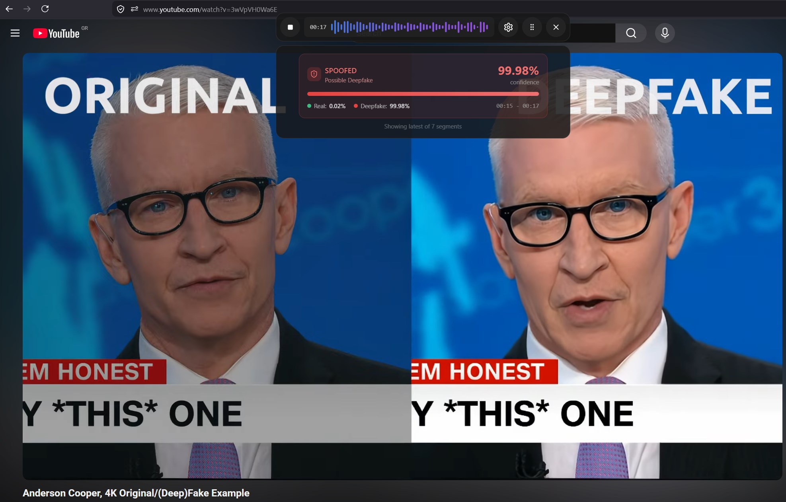

# Behavioral Signals Deepfake Detector

Real-time audio deepfake detection for your desktop.

Deepfake Detector by Behavioral Signals protects you from AI-generated voice fraud in real time.

As synthetic audio becomes increasingly indistinguishable from genuine speech, bad actors are using voice cloning and deepfake technology to impersonate executives, colleagues, and trusted contacts on calls. Deepfake Detector runs in the background and alerts you the moment suspicious audio is detected.

## How it works

The app captures your system audio and streams it to Behavioral Signals' AI deepfake detection engine. Within seconds, it returns a confidence score indicating whether the voice you're hearing is real or synthetic. A compact floating bar keeps results visible while you work without interrupting your workflow.

## Key features

- **Real-time detection** — continuous analysis with results delivered as the audio plays on your computer
- **Non-intrusive overlay** — a minimal floating bar keeps the verdict in sight while you work
- **Works with any audio source** — audio calls, video conferencing apps, recording playback, YouTube and any social media platform

## Download

| Platform | Where |
|----------|-------|
| Windows 10/11 | [Microsoft Store](https://apps.microsoft.com/detail/9pmt49gcwjbj) (recommended), or installer / portable exe from the [latest release](../../releases/latest) |
| macOS 14.2+ | [Latest release](../../releases/latest) — DMG (Apple Silicon or Intel) |
| Linux | [Latest release](../../releases/latest) — deb, AppImage or Flatpak |

## Install

### Windows

Windows 10 (build 19041) or later is required for system-audio capture.

- **Microsoft Store (recommended):** install from the [Store page](https://apps.microsoft.com/detail/9pmt49gcwjbj) — updates are handled automatically.
- **Installer:** download `DeepfakeDetector-Setup-<version>.exe` from the [latest release](../../releases/latest) and run it. If Microsoft Defender SmartScreen warns about an unrecognized app, click *More info* → *Run anyway*.
- **Portable:** download `DeepfakeDetector-<version>.exe` and run it directly — no installation.

### macOS

macOS 14.2 (Sonoma) or later is required for system-audio capture (Core Audio Taps).

1. Download the DMG for your CPU from the [latest release](../../releases/latest): `DeepfakeDetector-<version>-arm64.dmg` for Apple Silicon (M-series), `DeepfakeDetector-<version>.dmg` for Intel.
2. Open the DMG and drag **DeepfakeDetector** into **Applications**.
3. If macOS blocks the first launch, right-click the app → *Open* (or allow it under *System Settings → Privacy & Security → Open Anyway*).
4. On first recording the app asks for permission to capture system audio — accept it.

### Linux

PulseAudio or PipeWire (`pipewire-pulse`) is required for system-audio capture.

- **Deb** (Debian/Ubuntu): `sudo apt install ./DeepfakeDetector-<version>-amd64.deb`
- **AppImage**: make it executable (`chmod +x`) and run. Requires FUSE.
- **Flatpak**: `flatpak install --user DeepfakeDetector-<version>-x86_64.flatpak`, then run with `flatpak run com.behavioralsignals.DeepfakeDetector`

> **Note (Wayland):** Wayland does not let applications keep a window always on top. If the
> floating bar gets covered by other windows, set it manually through the window menu
> (e.g. on GNOME: Alt+Space → "Always on Top").

## Requirements

A Behavioral Signals API account and credentials are required to use this application. Sign up at [platform.behavioralsignals.com](https://platform.behavioralsignals.com) and get free credits to get started.

---

© Behavioral Signals — [behavioralsignals.com](https://www.behavioralsignals.com)
